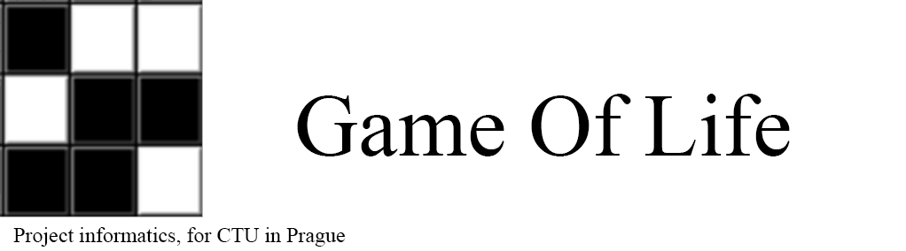

  

# PJIN-GameOfLife
Mady by Josef Jehlička, Jakub Zamazal, Philip Otto, Petr Kareš  
For CTU in Prague, Faculty of Civil Engineering, Department Of Geomatics, as product of school subject Project - Informatics  
Created by connecting Tkinter python library with MATLAB script  
## How to use
All user input and controls are available from GAME_OF_LIFE.exe (main.py)  
Instructions are available from info.html or through blue button in GAME_OF_LIFE.exe  
**This app requires MATLAB runtime 9.9 to work** 
Download here: https://www.mathworks.com/products/compiler/matlab-runtime.html  
## Files
**main.py** (compiled to GAME_OF_LIFE.exe) - _Main app, generates data.txt, gens.txt and rand.txt - these files are used as input into game_of_life.m that is atumatically started_  
**game_of_life.m**(compiled to generator.exe) - _Main MATLAB script that generates window with new generations_  
**info.html** - _Help in English_  
**info2.html** - _Help in Czech_     

used icon by www.wishforge.games on freeicons.io  
Music:  Southern Front Porch Whistler [Neverhood OST] - Terry S. Taylor
